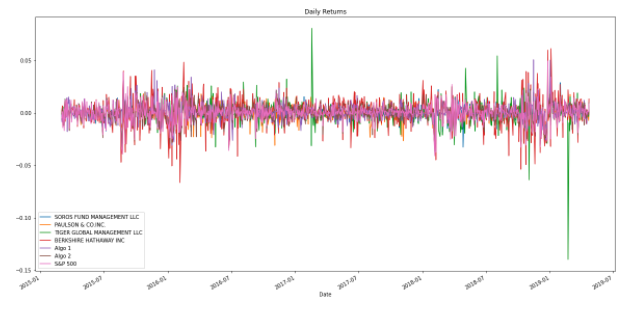
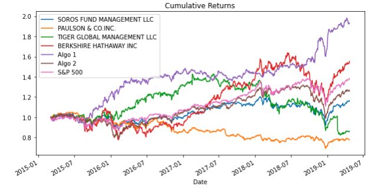
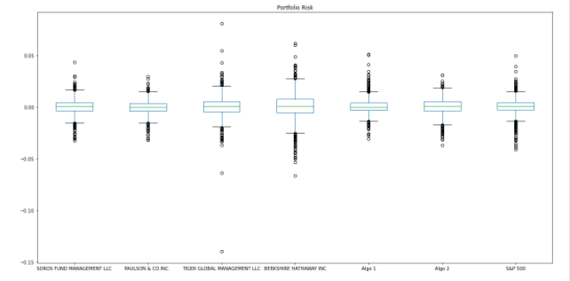
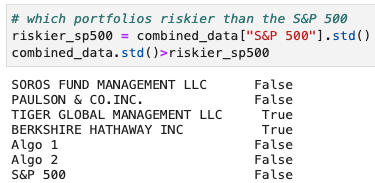
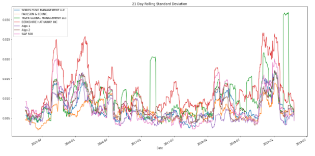
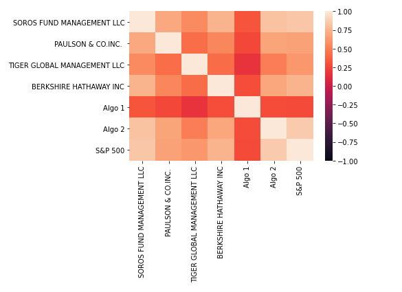
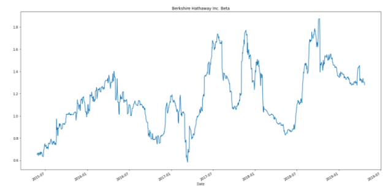
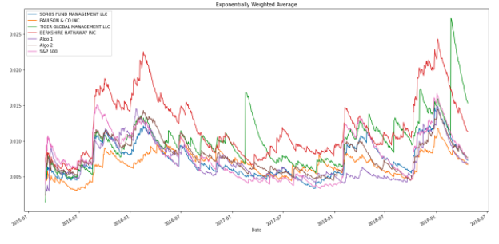
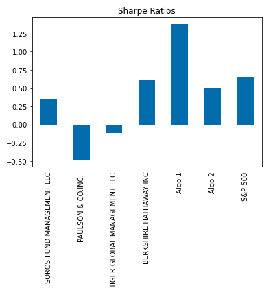

# Pandas Homework 2 | Whale Off the Port(folio)
Harold's company has been investing in algorithmic trading strategies. Using volatility, returns, risk, and sharpe ratio to determine which portfolio is performing the best. 
#### Portfolios Used for this Analysis
Whale Fund: Soros Fund Management LLC, Paulson & Co. Inc., Tiger Global Management LLC, and Berkshire Hathaway Inc. 
Algorithmic Funds: Algo 1 and Algo 2
S&P 500

## Portfolio Analysis 
Daily Returns: 

Cumulative Returns:

Here we can see the Whale fund did not beat the S&P 500, but Algo 1 did with Algo 2 trailing not too far behind the S&P 500. 

## Risk
Portfolio Risk:

As demonstrated by both the box and whisker plots and the standard deviations, the only two portfolios riskier than the S&P 500 are Berkshire Hathaway Inc. and Tiger Global Management LLC.

## Rolling Statistics
21 Day Rolling Standard Deviation:
Following the S&P 500 trail, most portfolios tend to follow a similar trend except the two riskier options Berkshire Hathaway Inc. and Tiger Global Management LLC. 

Correlation Heatmap:

Correlation coefficient heatmap helps us see how Algo 1 stands out among the pack as well as how specific funds trend the same coefficient across all various portfolios. Most of the coefficients fall into the weak category, thus not a strong indicator for selecting portfolios. 

Berkshire Hathaway Inc. Beta in Relation to S&P 500: 

Berkshire Hathaway Inc. beta often swings greater than 1 in relation to the S&P 500. With this volatile beta, we can conclude that Berkshire Hathaway Inc. is a riskier investment as it doesn't move with the market. Looking back at the cumulative returns, Berkshire Hathaway Inc. did outperform the S&P 500 despite it's volatility. 

Exponentially Weighted Moving Average: 

Using a half-life of 21 (time lag for the exponential weights to decay by one half), we can see the variation in rolling risk volatility. The higher weights on more recent data help better depict the risk associated with the portfolios. 

## Sharpe Ratios

Looking at the sharpe ratios, we can see the potential returns beyond the risk-free rate for a portfolio. 

# Summary
From this analysis, the portfolios that shine through are Berkshire Hathaway Inc., Algo 1, Algo 2, and the S&P 500. Harold's investment into algorithmic trading has proven to have paid off! 

