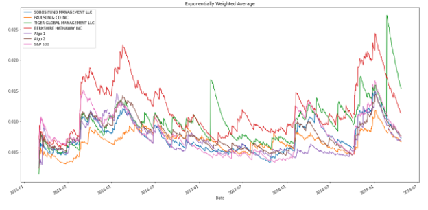

# Pandas Homework 2 | Whale Off the Port(folio)
Harold's company has been investing in algorithmic trading strategies. Using volatility, returns, risk, and sharpe ratio to determine which portfolio is performing the best. 

## Portfolio Analysis 
Daily Returns: 

Cumulative Returns:

Here we can see the Whale fund did not beat the S&P 500, but Algo 1 did with Algo 2 trailing not too far behind the S&P 500. 

## Risk
Portfolio Risk:

As demonstrated by both the box and whisker plots and the standard deviations, the only two portfolios riskier than the S&P 500 are Berkshire Hathaway Inc. and Tiger Global Management LLC.

## Rolling Statistics
21 Day Rolling Standard Deviation:
Following the S&P 500 trail, most portfolios tend to follow a similar trend except the two riskier options Berkshire Hathaway Inc. and Tiger Global Management LLC. 

## Sharpe Ratios

## Sharpe Ratios
